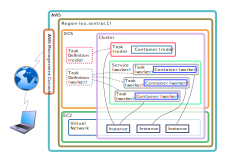

# Implementation

To put all of this together into a working solution, in the rest of this
tutorial, we're going to:

- Install some necessary software packages on our machine
- Build a Docker image which includes OMNeT++ and the worker code
- Deploy the system on AWS
- Run a simple simulation campaign with it using a custom client
- Take a look at all the code needed to perform the above

Before you begin, create a new empty folder. Later save all linked source files
from this tutorial in that.

## Solution Architecture

We will create the following architecture for running simulations on AWS:

We want to use Docker images for easy deployment, so we will use an ECS cluster.
One container will run a Redis-based job queue, and others will be workers. The
workers will need to run simulations, so their image will have OMNeT++ installed
in addition to the RQ worker client. After the worker completes a simulation
run, the results will be stored in the Redis database.

We will provide a custom tool that submits jobs to the job queue from the user's
computer and downloads the results after simulation completion.

The final architecture will look like this:



In the following sections, we will show how to implement this architecture.
We will discuss how to create the Docker images, how to configure the cluster,
how to implement the worker and the end-user client and so on.


## Preparation

First we need to install a few things on our computer.

### OMNeT++

Download the archive from the [official website](https://omnetpp.org/omnetpp).
Then follow the [Installation
Guide](https://omnetpp.org/doc/omnetpp/InstallGuide.pdf).

The `core` version will work fine as well, if you don't need the IDE.

### Docker

Follow the guides on the official website: [for
Ubuntu](https://docs.docker.com/engine/installation/linux/docker-ce/ubuntu/) or
[for Fedora](https://docs.docker.com/engine/installation/linux/docker-ce/fedora/).

Note that even if your distribution has Docker in its own native package
archive, it is most likely an outdated, and you will have to uninstall it first.

### Python 3 and pip3

We will use Python version 3; and pip, which is the recommended tool for
installing packages from the [Python Package Index](https://pypi.python.org/pypi).
Install these using the native package manager of your distribution.

On Ubuntu:

```terminal
$ sudo apt install python3 python3-pip
```

On Fedora:

```terminal
$ sudo dnf install python3 python3-pip
```

Then, in any case, upgrade `pip`:

```terminal
$ sudo pip3 install --upgrade pip
```

Feel free to use a `virtualenv` for this instead of `sudo` if you're familiar
with the concept.

### RQ

Use `pip` to install the RQ library:

```terminal
$ sudo pip3 install rq
```

This will install the `redis` client module as well, as a dependency.


### Getting the Code

Download the following files into the directory you just created:

 - [utils.py](code/utils.py) - Contains some common utilities used by both `worker.py` and `client.py`.
 - [worker.py](code/worker.py) -  Contains the code to be executed by the workers as a job.
 - [Dockerfile](code/Dockerfile) - Is a recipe to build the Docker image for the workers.
 - [client.py](code/client.py) - Is the client-side software to submit the simulations.

We will take a closer look at their contents in the "Examining the Code" chapter.

### Building the Docker Image


Building the image is done by issuing the following command in the directory
where the above files can be found:

```terminal
$ docker build . -t worker
```

The `Dockerfile` is picked up automatically by name, the build context is the 
current directory (`.`), and the resulting image will be named `worker`. 

This will likely take a few minutes to complete. If you see a couple of warnings
written in red, but the process continues, don't worry, this is expected.

### Publishing

Now that we built our image for the worker nodes, we need to make it available
for our AWS Instances by uploading it to Docker Hub.

First authenticate yourself (in case you haven't already) by typing in your
Docker ID and password after running this command:

```terminal
$ docker login
```

Now tag the image "into your repo", substituting your user name (Docker ID), so
Docker knows where to push the image:

```terminal
$ docker tag worker username/worker
```

And finally issue the actual push:

```terminal
$ docker push username/worker
```

This will upload about 400-500 MB of data, so it can take a while. Once it's
done, your image is available worldwide. You can see it appeared on [Docker
Hub](https://hub.docker.com/). You may even get email notification if it was
successful.
